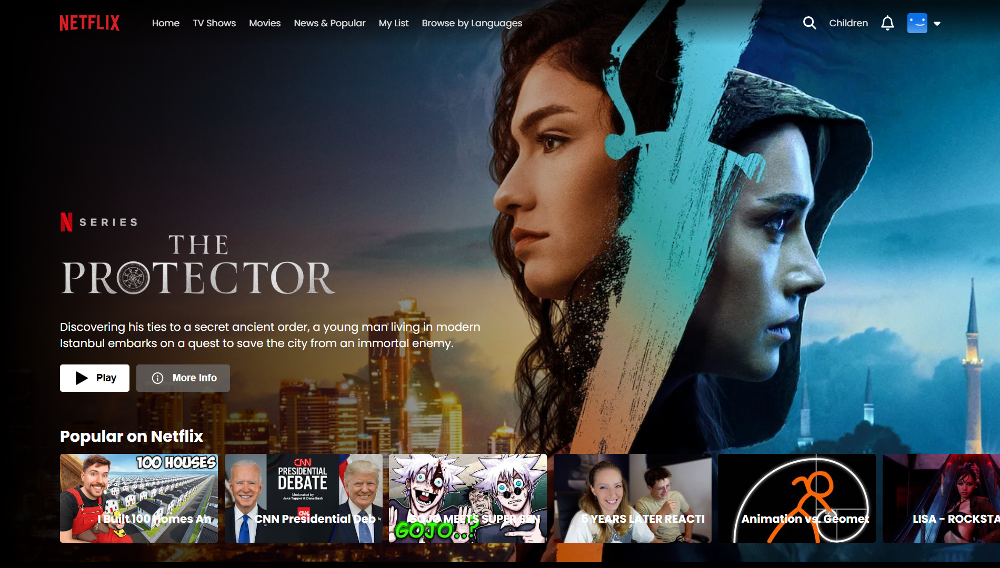

 # Netflix Clone with React and Vite

This project is a Netflix clone created using React and Vite, integrating the YouTube API for video content and Firebase for user authentication.

## Features

- **YouTube API Integration**: Fetches video content from YouTube for streaming.
- **Firebase Authentication**: Allows users to sign up, log in, and authenticate securely.
- **Responsive Design**: Designed with responsiveness in mind using modern CSS techniques.

## Technologies Used

- **React**: JavaScript library for building user interfaces.
- **Vite**: Fast, modern build tool for frontend development.
- **Firebase**: Backend-as-a-Service platform for authentication and data storage.
- **YouTube API**: Google's API for integrating YouTube functionality into applications.

## Screenshots

**User Sign Up**

**User Log In**

**Images**

## Demo

- View the video demo: [Netflix Video Demo](public/Netflix%20Video.mp4)

## Setup Instructions

1. **Clone the repository**:

2. **Install dependencies**:

3. **Set up Firebase**:
- Create a Firebase project and set up Authentication.
- Add your Firebase config details in `src/firebase/firebase.js`.

4. **Start the development server**:

5. **Open your browser**:
- Navigate to `http://localhost:3000` to view the app.

## Usage

- Sign up for an account, log in, and start exploring movies and shows using the Netflix clone interface.

## Contributing

Contributions are welcome! Please fork the repository and submit a pull request.

## License

This project is licensed under the MIT License - see the [LICENSE](LICENSE) file for details.
